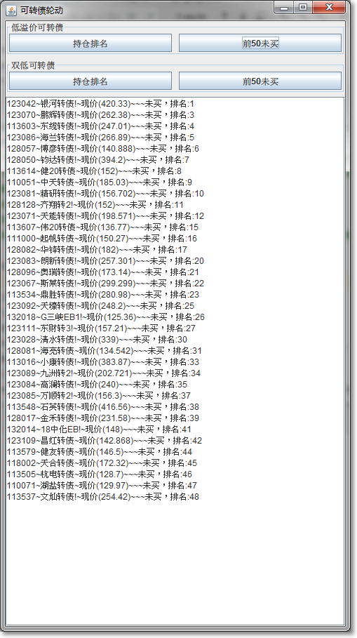

请务必按照下面的操作步骤来执行：

1.下载jdk：https://download.oracle.com/java/17/latest/jdk-17_windows-x64_bin.exe

2.下载GitHub里ConvertibleBondRotation\out\artifacts\ConvertibleBondRotation_jar。

3.获取低溢价可转债排名、双低可转债排名并粘贴到《可转债轮动.xls》。

4.从券商下载最新的持仓并粘贴到《可转债轮动.xls》。

5.关闭《可转债轮动.xls》！

6.双击执行ConvertibleBondRotation.jar，点击相应按钮即可得到需要轮动的结果。

